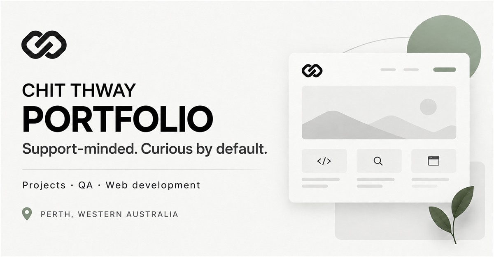
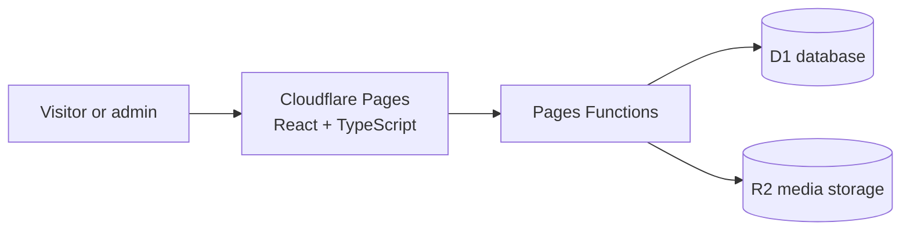

# CHIT THWAY — Portfolio

A production portfolio built to show the work behind the résumé: live projects, practical case studies, technical decisions and support-minded problem solving.

[**View the live portfolio**](https://chitthwayportfolio.com) · [LinkedIn](https://www.linkedin.com/in/chit-thway-197241332) · [GitHub profile](https://github.com/Chit-Thway)



## What it demonstrates

- Full product delivery—from design and development to testing and deployment.
- Practical troubleshooting, QA, documentation and service-management thinking.
- Responsive, accessible interfaces with project videos, slide decks and PDF viewers.
- A production Diary with secure administration, structured data and private media storage.

## Technology stack

| Area | Technology | Purpose |
| --- | --- | --- |
| Frontend | React 19, TypeScript, vinext, Vite | Component-based interface and production builds |
| Styling | CSS Modules, responsive CSS | Custom visual system across desktop and mobile |
| Hosting | Cloudflare Pages | Global delivery of the public portfolio |
| Backend | Cloudflare Pages Functions | Diary, authentication and visitor APIs |
| Database | Cloudflare D1 | Diary posts, media records and visitor data |
| Media | Cloudflare R2 | Private storage for Diary images, video and audio |
| Security | Signed HTTP-only sessions, same-origin checks, login throttling | Protection for the publishing workspace |
| Quality | ESLint, Node test runner, rendered-route and API tests | Automated checks for the frontend and backend |

## Architecture



Most portfolio content is rendered as static pages. Cloudflare Functions handle the features that require server-side behaviour, while D1 stores structured records and R2 serves protected Diary media.

## Main features

- Employer-focused project summaries with deeper case-study pages
- Public Diary with multi-image, video and audio posts
- Protected publishing and post-management interface
- Live projects, repositories, demonstrations and downloadable presentations
- Privacy-conscious visitor counter
- Keyboard navigation, visible focus states and reduced-motion support

## Run locally

Requirements: Node.js `>=22.13.0` and npm.

```bash
npm install
npm run dev
```

For the complete local Pages and Diary environment, configure `.dev.vars` from `.dev.vars.example`, then run:

```bash
npm run dev:pages
```

Production checks:

```bash
npm run check
```

## Project map

```text
app/                  Portfolio pages, components and content
app/data/projects/    One definition per portfolio project and the project registry
functions/api/        Cloudflare Pages API endpoints
server/               Authentication, Diary and media helpers
migrations/           D1 database migrations
public/               Images, videos, documents and presentations
tests/                Rendered-page, API, auth and storage checks
```

Profile and experience content is maintained in `app/data/portfolio.ts`. Each project's homepage and case-study content lives together in `app/data/projects/` and is exposed through the central project registry.

## Documentation

- [Portfolio release history](docs/portfolio-release-history.md)
- [Diary setup and operations](docs/diary-operations.md)

## Deployment

The production site is deployed through Cloudflare Pages at [chitthwayportfolio.com](https://chitthwayportfolio.com).

```bash
npm run build:pages
npx wrangler pages deploy dist/client --project-name chitthway-portfolio --branch main
```

Designed, built, tested and deployed by **Chit Thway** in Perth, Western Australia.
